<div align="center">

# MEHDI ALI

```text
imehdiali9@github ~ $ whoami
```

</div>

<table>
<tr>
<td width="42%" align="center">


</td>

<td width="58%" align="center">


</td>
</tr>
</table>

<br>

<div align="center">



</div>

<br>

<div align="center">

```text
imehdiali9@github ~ $ echo "building things that shouldn't exist"
```

</div>
